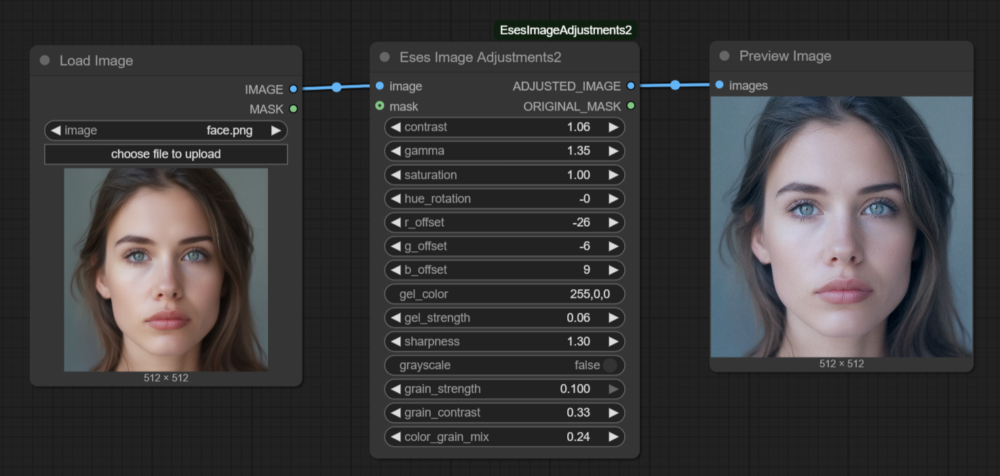

# Eses Image Adjustments



## Description

The 'Eses Image Adjustments' is a ComfyUI custom node designed for simple and easy to use image post-processing. It provides a sequential pipeline for fine-tuning various image aspects, utilizing PyTorch for GPU acceleration and efficient tensor operations. If you want a node with minimal dependecies, and don't want to download ten nodes to get images adjustment features, then give this one a try! 

💡 This is not a replacement for separate image adjustment nodes, as you can't reorder operations here (these are done pretty much in order you see the UI elements). 

💡 This node is meant for quick and easy to use color adjustments. 

🎞️ Film grain is relatively fast (mainly the reason I put this together), 4000x6000 pixels image takes ~2-3 seconds to process.


## Features

* **Global Tonal Adjustments**:
    * **Contrast**: Modifies the distinction between light and dark areas.
    * **Gamma**: Manages mid-tone brightness.
    * **Saturation**: Controls the vibrancy of image colors.

* **Color Adjustments**:
    * **Hue Rotation**: Rotates the entire color spectrum of the image.
    * **RGB Channel Offsets**: Enables precise color grading through individual adjustments to Red, Green, and Blue channels.

* **Creative Effects**:
    * **Color Gel**: Applies a customizable colored tint to the image. The gel color can be specified using hex codes (e.g., `#RRGGBB`) or RGB comma-separated values (e.g., `R,G,B`). Adjustable strength controls the intensity of the tint.

* **Sharpness**:
    * **Sharpness**: Adjusts the overall sharpness of the image.

* **Black & White Conversion**:
    * **Grayscale**: Converts the image to black and white with a single toggle.

* **Film Grain**:
    * **Grain Strength**: Controls the intensity of the added film grain.
    * **Grain Contrast**: Adjusts the contrast of the grain for either subtle or pronounced effects.
    * **Color Grain Mix**: Blends between monochromatic and colored grain.


## Requirements

* Python >= 3.9  (tested only with Python 3.12)
* PyTorch (you should have this if you have ComfyUI installed.)


## Installation

1.  **Navigate to your ComfyUI custom nodes directory:**
    ```
    ComfyUI/custom_nodes/
    ```

2.  **Clone this repository:**
    ```
    git clone https://github.com/quasiblob/ComfyUI-EsesImageAdjustments.git
    ```

3.  **Restart ComfyUI:**
    * After restarting, the "Eses Image Adjustments 2" node will be available in the "Eses Nodes/Image Adjustments" category.


## Folder Structure

```
ComfyUI-EsesImageAdjustments/
├── init.py                 # Main module defining the custom nodes.
├── image_adjustsments_2.py # The Python file containing the node logic.
├── README.md               # This file.
├── requirements.txt        # Python package dependencies.
└── docs/                   # Optional documentation assets (images, etc.)
```


## Usage

* Connect your image tensor to the `image` input of the `Eses Image Adjustments 2` node within ComfyUI.
* Adjust the desired parameters using the provided sliders and input fields.
* The node outputs the `adjusted_image` tensor, maintaining compatibility with other ComfyUI nodes.
* An optional `mask` input is also available, which will be passed through to the `original_mask` output.


## Category

Eses Nodes/Image Adjustments


## Contributing

- Feel free to report bugs and improvement ideas in issues, but I may not have time to do anything.


## License

- See LICENSE.txt


## Update History

* 2025.6.27 Version 1.1.1
* 2025.6.20 Version 1.0.0 released


## ⚠️Disclaimer⚠️

This custom node for ComfyUI is provided "as is," without warranty of any kind, express or implied. By using this node, you agree that you are solely responsible for any outcomes or issues that may arise. Use at your own risk.


## Acknowledgements

Thanks to the ComfyUI team and community for their ongoing work!